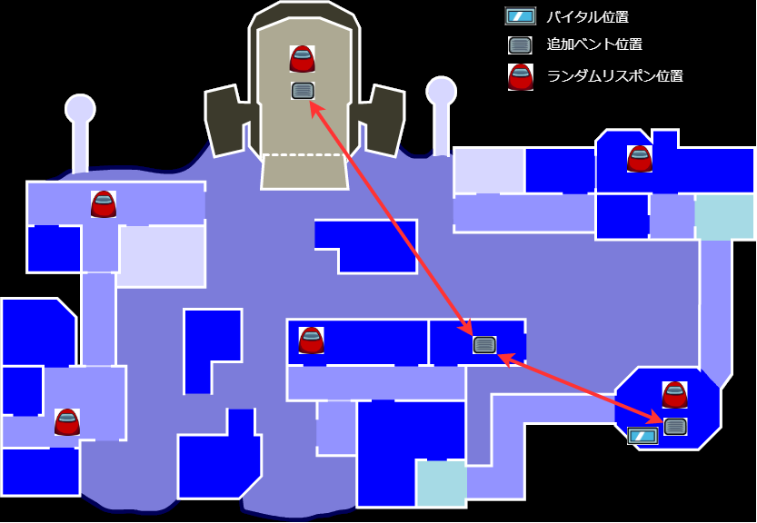

# The Other Roles: GM Edition Customized by Haoming
This repository is forked from [Th Other Roles GM Edition](https://github.com/yukinogatari/TheOtherRoles-GM)  
Im adding experimental ideas here.  
It means my repository contais lots of bugs.  (feel free to make issue)

This Repository contains original roles and features as below

## Map modification features(Polus)
- Random Respawn
- Additional Vents
- Move Vital to Specimen

## Map modification features(AirShip)
- Add Wall Check on Certain Tasks(AirShip)  # original idea from [AuShipMod](https://github.com/tomarai/AUShipMod)

## Original Roles
Description of Roles I created.(some of them are exported to The Other Roles GM)

| Impostors | Crewmates | Neutral | Other | 
|----------|-------------|-----------------|----------------|
|[SerialKiller(exported)](#SerialKiller)| [FortuneTeller(exported)](#FortuneTeller) |[Fox(exported)](#Fox) ||
|[EvilHacker](#EvilHacker) # original idead from [here](https://github.com/tomarai/TheOtherRoles)|[Incompetent](#Incompetent)|[Immoralist(exported)](#Immoralist)|
|[LastImpostor](#LastImpostor)||[Schrodinger's Cat](#Schrodinger'sCat)|
|[Trapper(experimental)](#Trapper)||[Puppeteer(experimental)](#Puppeteer)|
|[Bomber(experimental)](#Bomber)||||
|[EvilTracker](#EvilTracker)||||
|[Mimic](#Mimic)||||

### SerialKiller
SerialKiller is an impostor who has shorter kill cooldown.  
After first kill, suicide timer starts and if it becomes 0 he kills yourself.  
If you make a kill, The time is reset.  
The timer is reset afteremergency meeting(option)  

### EvilHacker
Evil Hacker is an impostor who has two ability.
1. He can see admin anywhere.
2. He can creates Madmate from chosen player.

### LastImpostor
Last impostor is an impostor role that the last living impostor acquires.  
last impostor gets additional ability if he kills number of players is set in settings.  
last impostor can  use guesser or divination ability.  (otpion)

### Trapper
Trapper is an impostor role who has ability to set a trap.  
Trapper can also make normal kill but it makes penalty time to cooldown.  
When Trapper set trap, it makes sounds and trap becomes visible for few secs.  
If player get caught by trap, trap will starts countdown to kill.  
After certain time, player will be killed with sound.  
If other player contact to trapped player, trap will be disabled.  
If trapper kills trapped player directly, trapper get bonus cooldown time.  

Note
1. If Trapper makes normal kill, trap will be disabled
2. If next trap is set, first one will be disabled

### Bomber
Bomber is 2 pair of impostor role who has bomb ability.  
Both Bomber can plant bomb to player.  
If both bomber plant bomb, they will have arrows to each other.  
After that if both bomber stay together, explosive button will be available.  
One of bomber use explosive button, the target get killed by bomb.  
If one bomb is explode, other one will be disabled.  

If one of bomber is dead, remain one becomes normal impostor.  
(both dies if option is on)

### EvilTracker
Evil tracker is an impostor role who has ability to track players.  
Evil tracker can see arrows that point to other impostors and he can select one  player to track.  

Evil tracker can see kill flash if other impostor kills.  (option)

### Mimic
Mimic is a 2 pair of impostor role.  
The Killer has ability to erase dead body and morph to killed player.  
If Killer kills player, dead body is erased and Killer morph to killed player.  
(Killer cant cancel morph until meeting is called)  
Killer can see arrow to Assistant. if color is white, assistant is morphing to you  

The Assistant  does not have ability to kill crewmate, but has ability to fake partner's alibi.  
1. The Assistant can see Flash if Killer kills.
2. The Assistant has portable admin.
3. The Assistant can see arrow to killer.
4. The Assistant can morph to killer.

### FortuneTeller
Fortune teller is crewmate role who has ability to divine  
Fortune teller is shown as crewmate, until he completes number of tasks is set in settings.  
After completed tasks, Fortuneteller can divine single player but cant start emergency meeting  
Divination is only available for once  

Fortune teller can divine players if player is dead or he has contacted player for certain duration  
Fox, Puppeteer and Schrodinger’s Cat are killed if they get divined

### Incompetent
Incompetent is a crewmate role who has disadvantage effect.
Incompetent is shown as crewmate, he cant realize he is incompetent
After first emergency meeting, incompetent has chance to get strange vision
Strange vision only effects in Incompetent’s vision.
The appearance of the players will be shuffled if strange vision is ON
(Chance and number of players to be shulffled are set in settings)

### Fox
Fox is a neutral role has unique win condition.  
His win condition is to complete tasks and survive until the end.  
He has strong win condition but he can't fix sabotage.  
He can create Immoralist from unkillable players, Immoralist can help fox to pretend  to fix sabotage. (Option)  

If he fills his win condition, he overwrites other player’s win except neutral role's solo win.  
 (Exceptions:  Jester, Arsonist, Vulture,  Plague doctor Puppeteer etc...)   
In other words，Fox cant win until other player fills win condition    

Fox has two ability to survive
1. Fox can stealth, no one can target fox if he is invisible. 
2. Fox can see arrows that point to player who can kill Fox.

Note.
- Fox is not countted as single player  
If 1 fox, 1 impostor, 1 crewmate are remain it will trigger impostor win  
(If fox completes tasks, fox win)

### Immoralist
Immoralist is a familiar of Fox.  
He wins when Fox wins but he dies when Fox dies.  
He can help Fox to survive by fixing sabotage instead of Fox.  

Immoralist has 3 ability to help fox.
1. Immoralist can see flash when other players dead.
2. Immoralist can suicide
3. Immoralist can see arrow that point to Fox(Option)

### Schrodinger'sCat
Schrodinger's Cat is a neutral role has no win condition in the beginning  
He can get win condition when he get killed.  
He will join the team that killer is belonging and get revive.  

He become Crewmate when exiled  
(becom random team if option is on)  

He gets ability, according to joining team

- Jackal: ability to kill  
- Impostor: ability to kill and sabotage/ no ability (depends by option)  
- Crewmate: no ability, no tasks  

### Puppeteer
Puppeteer is neutral role has unique win condition.  
He gets enough points that set in settings to win.  

He can get point by two way.(2. is only allowed if puppeteer is alive)  
1. Get killed his dummy doll(sampled player becomes dead if puppeteer is alive)
2. Get exiled player who are sampled(except jackal and impostor)

Puppeteer can take sample from player and create dummy doll from sample.  
Puppeteer can control dummy doll with far sight.  
While controlling dummy doll, Puppeteer becomes invisible.  
Dummy doll can be controlled by WASD and E/SPACE(lift up/down,open doors).

Laughing sound will be played on meeting start if sampled player is killed and Puppeteer is alive.
Puppeteer can see arrows that point to killable players.

